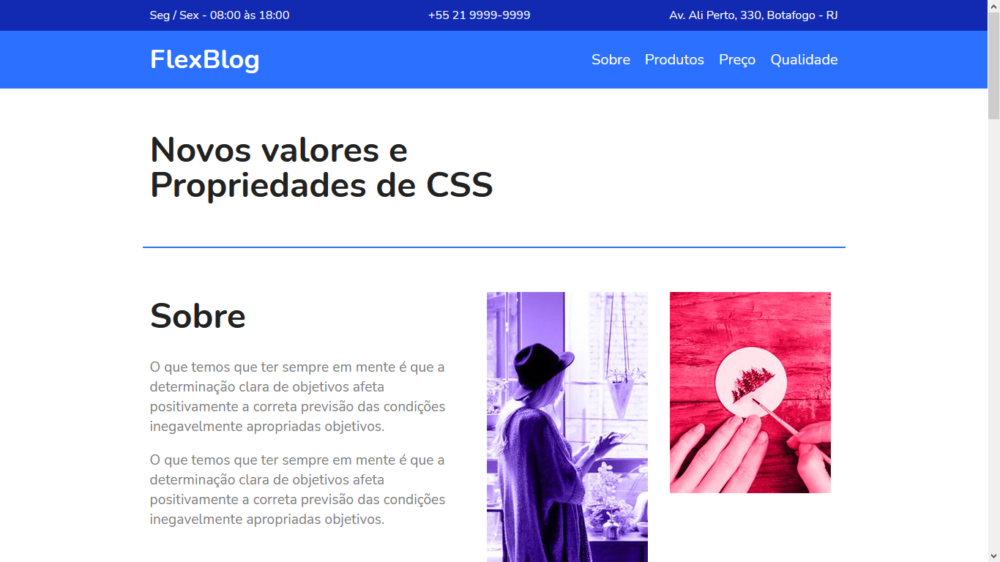
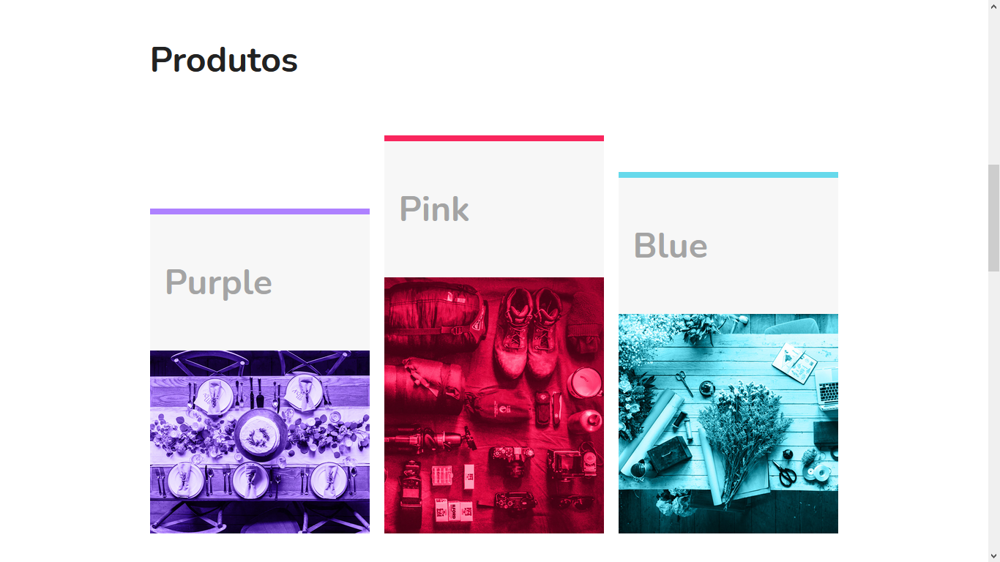
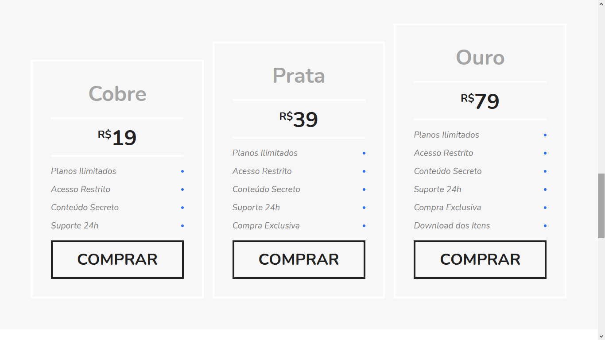
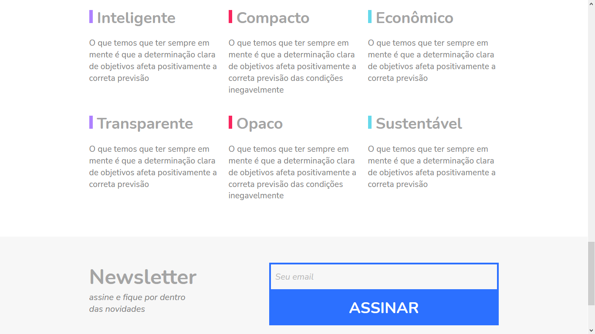

# FlexBlog
Landing page developed to apply the concepts of <strong>css flex-box design</strong>

## About the project

Responsive website using css flex-box, developed during the tutorial: <a href="https://www.origamid.com/curso/css-flexbox/">CSS Flexbox</a> of the website <a href="https://www.origamid.com/" >Origamid</a> 

<ul>
<li> access the page <a href="https://lucavini.github.io/FlexBlog//">here</a> </li></ul>

